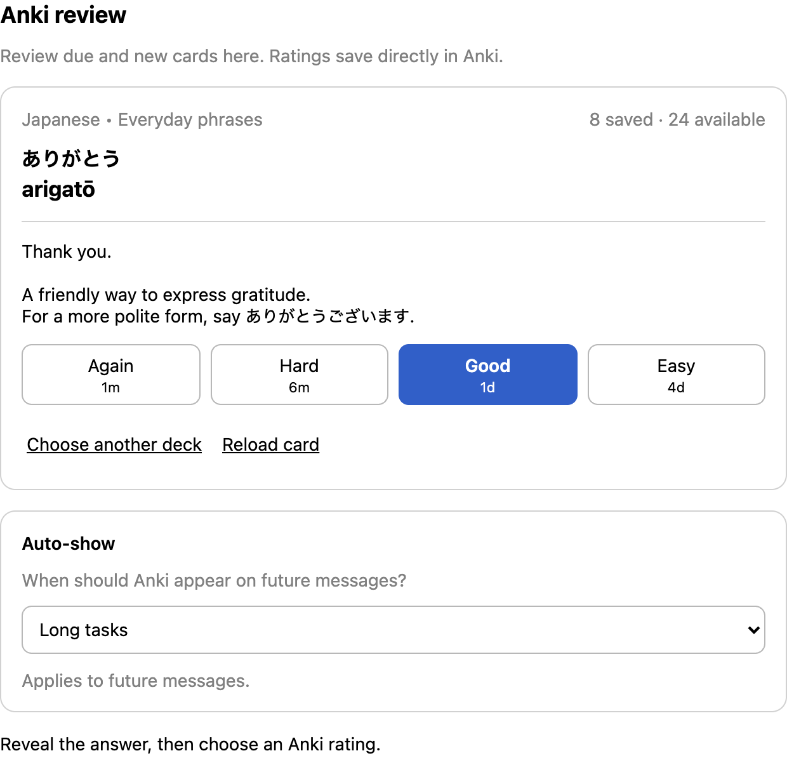
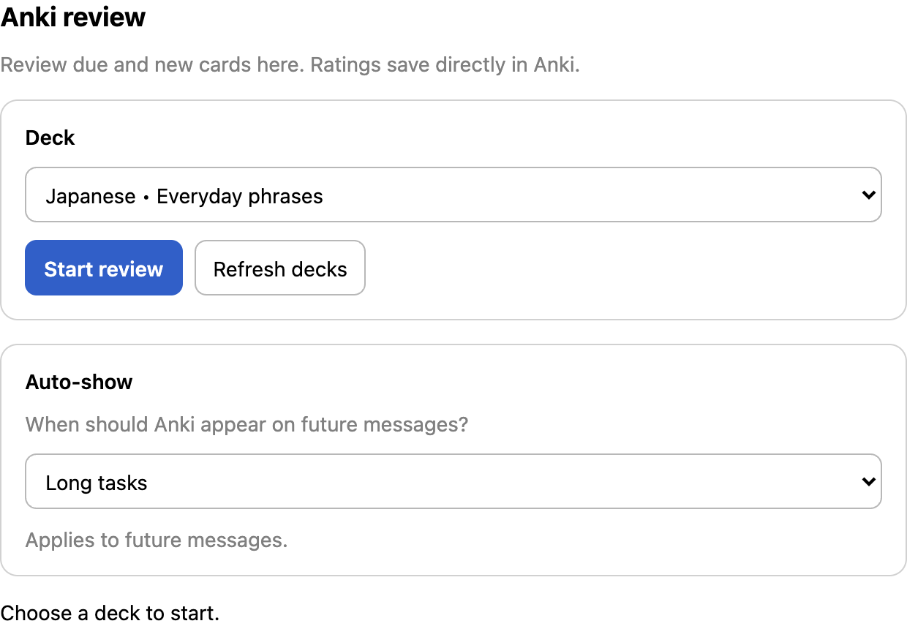

# While Anki

**Review your flashcards while Codex works.**

While Anki puts your Anki deck inside a Codex conversation. Reveal an answer, rate the card, and move to the next one while Codex handles your task. Ratings save directly in Anki, and the review panel hides when Codex finishes.

- **Your own decks** — review due and new cards, with supported images and audio.
- **Familiar ratings** — Again, Hard, Good, and Easy update your Anki schedule.
- **One review panel** — the next card appears in place, without adding chat messages.
- **Optional auto-show** — open Anki for longer tasks or every message.



*The review panel with a sample card. Screenshots use example data.*

## Get started

You’ll need the **Codex desktop app**, **Anki with a deck**, and **[Node.js 22 or newer](https://nodejs.org/)** on the same computer. The commands below use the `codex` CLI.

### 1. Connect Anki

In [Anki](https://apps.ankiweb.net/), open **Tools → Add-ons → Get Add-ons** and enter this code to install [AnkiConnect](https://ankiweb.net/shared/info/2055492159):

```text
2055492159
```

Restart Anki and leave it open while you review.

### 2. Install While Anki

Run these commands in a terminal:

```sh
codex plugin marketplace add gustanas/llm-anki-convo
codex plugin add while-anki@llm-anki-convo
```

The plugin comes ready to run; no repository clone or build is needed.

### 3. Start reviewing

Open a **new Codex task** and include this with your request:

> Show Anki while you work, then hide it when you finish.

Choose a deck and click **Start review**. Think of the answer, click **Show answer**, then choose your rating. Use the play button for audio. Your last deck is remembered for next time.

## Make it automatic

Choose an **Auto-show** setting in the review panel:

| Setting | When Anki appears |
| --- | --- |
| **Off** (default) | Only when you ask. |
| **Long tasks** | During work such as coding, research, and file changes. |
| **Every message** | During quick questions and longer tasks. |



The setting carries over to future tasks on this computer. Say **“no Anki for this task”** to skip it. Hiding the panel keeps your current review session and does not rate the card.

If Codex asks you to trust the plugin’s hooks, review them with `/hooks` so auto-show can run. The panel appears after Codex starts processing your request, so it may take a moment.

## Good to know

**Ratings count.** These are real Anki reviews. The queue includes all available due and new cards, **even beyond your deck’s daily limits**. Future, suspended, and buried cards are excluded.

**Card layouts may look different.** The panel displays card text and supported local images and audio. Custom Anki templates and add-on controls may not carry over; missing or unsupported content is reported in the panel.

**Anki runs locally.** The plugin connects to Anki on your computer and stores preferences and review sessions locally. Card text and media are displayed inside Codex.

## Need help?

| Problem | What to try |
| --- | --- |
| Anki won’t connect | Keep Anki open, check that AnkiConnect is installed, and close any blocking Anki dialog. Then try **Refresh decks** or **Reload card**. |
| A rating wasn’t confirmed | Use the **Check** button for your selected rating. If it remains unresolved, check the card in Anki. |
| Audio or an image won’t load | Read the notice in the panel and check that the media works in Anki itself. |
| Anki doesn’t appear automatically | Check **Auto-show** and review the plugin’s hooks with `/hooks`. |

See the [plugin guide](plugins/while-anki/README.md) for configuration, data locations, and migration from an earlier installation.

## Development

From the repository root:

```sh
npm ci --prefix plugins/while-anki
npm run build
npm test
```

The plugin lives in `plugins/while-anki/`; shared AnkiConnect and card/media parsing code lives in `lib/`. The build regenerates the bundled server and widget. Tests use local fixtures and do not grade cards in your collection. See the [development guide](plugins/while-anki/README.md#develop-and-verify) for the optional live smoke test.
